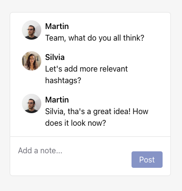
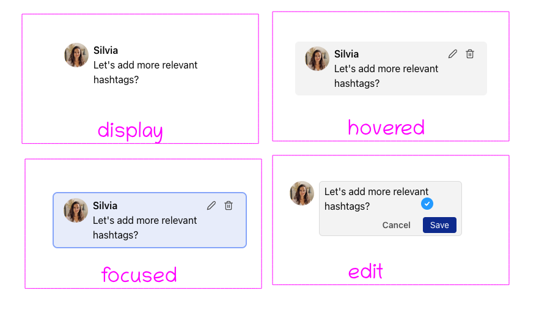

# Front-End Async Exercise

> _Hey there!_ 👋
>
> Below you'll find a coding exercise similar to tasks you might encounter on
> our team. It's designed to take around 4-6 hours. Our engineers will be
> available to answer any questions and collaborate asynchronously.
>
> After you finish, present the results to us asynchronously. Based on your
> solution, we may invite you to a technical interview.
>
> - Team Representative

⛳ Objective: To enhance our platform's user collaboration features, we'd like
you to implement a notes feature. This should enable users to post, edit, and
delete notes for posts.

## 🍎 Assignment

You're tasked with developing a widget for handling notes. It should support
keyboard navigation and shortcuts.

- Display all notes in a list showing the note's contents, author name, and
  avatar.
- Include a textbox for users to write and post a new note by pressing `Enter`.
- Navigate between notes using the arrow keys `↓` / `↑`. Highlight the focused
  note.
- Enable editing by pressing `E` and deletion by pressing `D` or `DEL` when a
  note is focused.
- Only allow the current user to edit or delete their notes.



## ⚙️ Technical requirements

We've sent you a zip file with a starter repo. It's set up with Vite + React +
JavaScript + ESLint. Modify this as you see fit.

- Use React and JavaScript.
- Minimize additional dependencies.
- Use git to commit your code to demonstrate your workflow.
- Feel free to modify the UI design for a better UX.

## ☂️ How to complete the exercise

We have a communication channel set up for questions.

Commit your code like you'd normally do for a project. Design, test, and
document it as if it's going into production.

You can present your work through documentation or a video. Share the code as a
zip file, but exclude the `node_modules` folder.

After this, we'll internally review your code and provide feedback. Based on
this, we may invite you to a technical interview to discuss your work and other
technical topics.

## 🌏 API

A mock API server is bundled in the repo inside the `/api` folder.

- **GET** `/status` Returns status of the API
  ```json
  { "status": "ok" }
  ```
- **GET** `/me` Returns the user info for the current user.
  ```json
  {
    "id": "904dec6a",
    "email": "kateryna@buffer.com",
    "name": "Kateryna",
    "avatarUrl": "https://avatars.githubusercontent.com/u/10474869"
  }
  ```
- **GET** `/notes` Returns a list of notes
  ```json
  [
    {
      "id": "i1zu6e2tv",
      "text": "This looks great! 🌮",
      "createdAt": "2023-05-01T17:30:00.000Z",
      "authorId": "lncbqp0kp",
      "author": {
        "id": "lncbqp0kp",
        "name": "Kateryna",
        "email": "kateryna@buffer.com",
        "avatarUrl": "https://avatars.githubusercontent.com/u/10474869"
      }
    },
    {
      "id": "pr19cmz49",
      "text": "Maybe let's try a different color?",
      "createdAt": "2023-05-01T17:30:00.000Z",
      "authorId": "fkydmiif9",
      "author": {
        "id": "fkydmiif9",
        "name": "Edu",
        "email": "eduardo@buffer.com",
        "avatarUrl": "https://avatars.githubusercontent.com/u/829971"
      }
    }
  ]
  ```
- **POST** `/notes` Creates a new note with current user as an author
  ```json
  { "text": "hello world" }
  ```
  ```json
  {
    "id": "k952j3dg6",
    "text": "hello world",
    "createdAt": "2023-08-29T07:31:35.880Z",
    "authorId": "bthcxsnhm",
    "author": {
      "id": "904dec6a",
      "email": "kateryna@buffer.com",
      "name": "Kateryna",
      "avatarUrl": "https://avatars.githubusercontent.com/u/10474869"
    }
  }
  ```
- **PATCH** `/notes/:id` Updates a note’s text
  ```json
  { "text": "new text" }
  ```
  ```json
  {
    "id": "k952j3dg6",
    "text": "new text",
    "createdAt": "2023-08-29T07:31:35.880Z",
    "authorId": "bthcxsnhm",
    "author": {
      "id": "904dec6a",
      "email": "kateryna@buffer.com",
      "name": "Kateryna",
      "avatarUrl": "https://avatars.githubusercontent.com/u/10474869"
    }
  }
  ```
- **DELETE** `/notes/:id` Deletes a note by id
  ```json
  { "id": "k952j3dg6", "deleted": true }
  ```

ℹ️ All API endpoints have a 5% failure rate, responding with a
`500 Internal Server Error`.

## 🔍 What we are looking for

Here are our main evaluation criteria:

- The feature should be complete and stable, handling edge-cases sensibly.
- Code should be well-organized, readable, and adhere to industry best
  practices.
- The UI should be user-friendly, cohesive, and visually appealing.
- We value automated tests; 100% coverage isn't necessary but we want to see
  your approach.

## 📎 Assets

- Check the image below for design specs for note states ↓
  
- We're using [feather icons](https://feathericons.com/) for edit and delete,
  SVG files are included ↓
  - [Edit](./design/edit.svg)
  - [Trash](./design/trash.svg)
